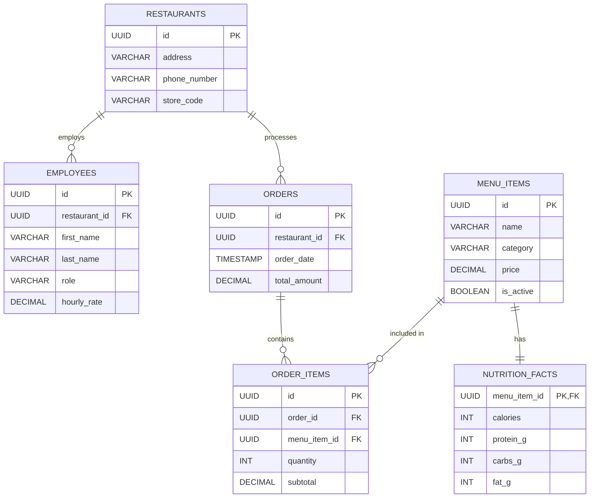

# Hanna_Ignat_DB_Assignment_4

ERD



Indexes optimisation:

code:
```
EXPLAIN ANALYZE 
SELECT * FROM order_items 
WHERE order_id = 'bd604b49-a053-40d9-9aac-ad4f88913322';
```
indexes:

```
CREATE INDEX idx_orders_restaurant_id ON orders(restaurant_id);
CREATE INDEX idx_orders_order_date ON orders(order_date);
CREATE INDEX idx_order_items_order_id ON order_items(order_id);
CREATE INDEX idx_order_items_menu_item_id ON order_items(menu_item_id);
```


result without:


result with them:


View, roles, procedure, triger, etc in scripts file.

### Database Relationships

**1:1 (One-to-One)**
* **Example:** A **Menu Item** and its **Nutrition Facts**. A Whopper has exactly one set of nutritional macros, and that specific set of macros belongs only to the Whopper

**1:M (One-to-Many)**
* **Example:** **Orders** and **Menu Items**.  single order can contain many different burgers and drinks. At the same time, a specific burger (like a Cheeseburger) can appear in thousands of different orders. The junction table `order_items` sits between them to record each specific

**M:M (Many-to-Many)**
* **Example:** **Orders** and **Menu Items**. A single order can contain many different burgers and drinks. At the same time, a specific burger (like a Cheeseburger) can appear in thousands of different orders. The junction table `order_items` sits between them to record each specific instance.

### Database Constraints
* **Primary Key (PK):** `id UUID PRIMARY KEY`
* **Foreign Key (FK):**  You cannot assign an employee to a `restaurant_id` that doesn't exist
* **Check:** `CHECK (price >= 0)` ensures an item cannot have a negative cost
* **Unique:** `store_code UNIQUE` ensures two branches don't accidentally get the same code
* **Not Null:**`first_name NOT NULL` means an employee record must have a name

### In this project were responsible:

**Ignat**-For normilize db architecture, ddl scripts, role, view, index

**Hanna**-Python generation script, procedure and triggers, explain analyse
